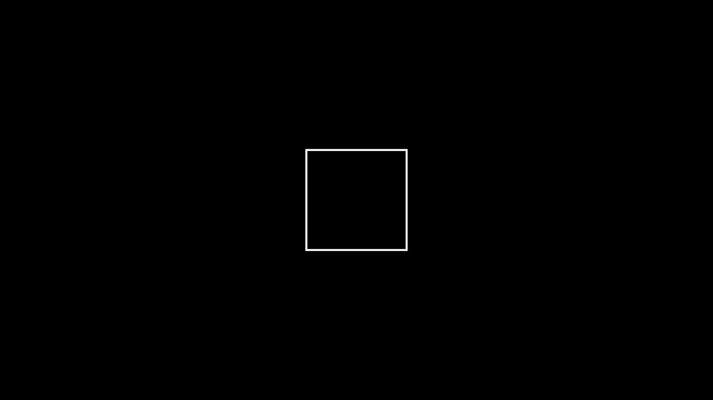
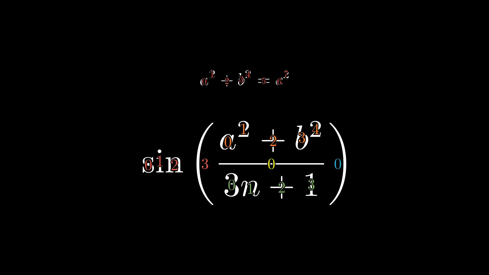

# Welcome!
MF-Tools is a collection of various utilities that are helpful for creating Manim scenes.

The most significant among them is TransformByGlyphMap, but there are also several other small tools in the collection, and I expect to continue to grow the collection over time.


## Transforms

### TransformByGlyphMap
This animation class dramatically simplifies the process and syntax of animating complicated transformations of complicated mobjects. It was made to be used with MathTex for things like algebra animations, but it can be used for any VMobject.

Like all Transforms, it receives two mobjects, but its primary parameter after that is its glyph_map. This consists of an arbitrary number of 2-tuples of lists of integers, such as

`([3,4,8,9], [0,1,3]),` <br>
`([0], [5]),` <br>
`([1,2], [2,4])` <br>

Each tuple will send the VGroup of submobjects at the first list of indices in the starting mobject, to the VGroup of submobjects at the second list of indices in the target mobject, with a simple `ReplacementTransform`.

If one of the lists is empty, such as

`([], [1,4]),` <br>
`([8,9,10], [])`

it will instead trigger an introducer (default `FadeIn`) or a remover (default `FadeOut`) to act on that VGroup of submobjects. If you would prefer a different introducer/remover, you can replace the empty list with the animation of your choice, such as

`(Write, [5,6,7,8])`

Each glyph_map entry can receive an optional third element, which is a dictionary of kwargs to be passed to the corresponding animation. For example,

`([3,4,5], [5,6,7], {"path_arc":PI/2}),` <br>
`([7,8,9,10,11], [], {"run_time":0.5})`

As the glyph_map is parsed, all of the indices that are mentioned are recorded for both the original and target mobjects. It is expected that the indices that are NOT mentioned will be equally numerous between the two. If so, each of those submobjects will be `ReplacementTransform`ed into one another, in order, so that every single submobject of the original is accounted for and transformed into a submobject of the target. If not, the transform will not work, and it will instead trigger the alternate mode of the animation, which places both the original and target mobjects vertically next to each other and reveals the index labels of the submobjects. This is intended to help the user in correcting their indexing mistake.

If you're still awake, here is a demonstration:

```
```

TransformByGlyphMap can accept many additional parameters to control its behavior. The following is an exhaustive list of its parameters and what they do:

- **mobA -** Starting mobject (required)
- **mobB -** Target mobject (required)
- **\*glyph_map -** Arbitrarily long sequence of tuples of lists of integers. Each one can have an optional third element which is a dictionary of kwargs. This is certainly the most important parameter and controls almost everything that happens. See above for a detailed explanation.
- **from_copy -** Boolean, defaults to False. If True, then the original mobA will be left alone while a copy of it is transformed into mobB.
- **mobA_submobject_index -** List of integers. Determines which submobject of A, or which submobject of which submobject of A, etc., upon which to act. Defaults to [0], which is perfect for the structure of MathTex mobjects.
- **mobB_submobject_index -** List of integers, defaults to [0]. Same as mobA_submobject_index, but for the target mobject.
- **default_introducer -** Animation, defaults to FadeIn. The introducer to use when the first list of indices in a glyph_map entry is empty.
- **default_remover -** Animation, defaults to FadeOut. The remover to use when the second list of indices in a glyph_map entry is empty.
- **introduce_individually -** Boolean, defaults to False. If True, then introducers will be applied individually to each submobject mentioned by a glyph_map entry, rather than to them all as a VGroup. Makes no difference for FadeIn, but can be nicer for Write or GrowFromPoint.
- **remove_individually -** Boolean, defaults to False. Same as introduce_individually, but for the removal animations.
- **shift_fades -** Boolean, defaults to True. If True, then the introducers and removers will receive a shift parameter in the general direction of motion between the two mobjects being operated on. Really only noticeable if the two mobjects are in substantially different positions, it can be jarring for most glyphs to travel far but the fades stay in place.
- **show_indices -** Boolean, defaults to False. If True, then the results of the glyph_map are ultimately discarded (although it is still processed) and the indices of the submobjects being operated on are shown. This is useful for writing the glyph_map in the first place, making it easy to see which indices need to go where and in what way. This mode can also be triggered by the presence of an empty glyph_map entry `([], [])`, or by a mismatch in the number of indices not mentioned in the glyph_map.
- **allow_mismatch -** Boolean, defaults to False. If true, then only the animations specifically declared in the glyph_map will be performed, and unmentioned indices of both mobjects will be left alone. This way, the user can combine TransformByGlyphMap with other animations, either in sequence or in parallel, for transforming between the two mobjects.
- **A_index_labels_color -** Color, defaults to RED_D. The color of the index labels of the submobjects of mobA. Does nothing if show_indices is False and the animation proceeds successfully. The show_indices mode is only intended to be shown to the programmer and not the final viewer; I encourage you change it in the source code to your taste.
- **B_index_labels_color -** Color, defaults to BLUE_D. Same as A_index_labels_color, but for mobB.
- **index_label_height -** Float, defaults to 0.18. Determines the size of the index_labels. This is just the size I thought was nicest; change in the source code to your taste.
- **printing -** Boolean, defaults to False. If True, then each entry of the glyph_map is printed to the console, followed by the lists of all mentioned and unmentioned indices from both mobA and mobB.
- **\*\*kwargs -** Arbitrary keyword arguments. These are passed to the ReplacementTransforms of the unmentioned indices, and to the final AnimationGroup of everything. Honestly not sure how useful this is, but you could use it for rate_function and run_time.

<br> <br>

Here are a few more examples of how you can use TransformByGlyphMap:


## Common Updaters

### Scene.keep_orientation()
***WARNING: Currently bugged/incomplete, as can be seen in the demo below***

Within a Scene one can perform

`self.keep_orientation(mob1, mob2, ...)`

This creates a scene updater which will maintain the orientation of all the passed mobjects, even if the higher mobject they may be a part of is rotated.
It achieves this by giving each mobject an invisible line as a submobject, and uses this line to measure and reset the mobject's angle.
Do not use this if the presence of this new submobject would disturb other code.

In this example, `side_length` is added as a submobject to `square`, so normally it would rotate with it.
Indeed, its position is rotated with the square, but because of `self.keep_orientation`, it remains upright.

```py
def construct(self):
    square = Square()
    side_length = MathTex("1.8").next_to(square, RIGHT)
    square.add(side_length)
    self.add(square)
    self.keep_orientation(side_length)
    self.play(Write(side_length))
    self.play(Rotate(square, 3*PI/2, about_point=ORIGIN, run_time=2))
    self.wait()
```


<!--
<div style="display: flex; flex-wrap: wrap;">
  <div style="width: 50%; box-sizing: border-box; padding: 10px;">
    <pre><code class="language-python">
class Demo_keep_orientation(Scene):
    def construct(self):
        square = Square()
        side_length = MathTex("1.8").next_to(square, RIGHT)
        square.add(side_length)
        self.add(square)
        self.keep_orientation(side_length)
        self.play(Write(side_length))
        self.play(Rotate(square, 3*PI/2, about_point=ORIGIN, run_time=2))
        self.wait()
    </code></pre>
  </div>
  <div style="width: 50%; box-sizing: border-box; padding: 10px;">
    
  </div>
</div>

<style>
@media (max-width: 600px) {
  div[style*="display: flex"] {
    flex-direction: column;
  }
  div[style*="width: 50%"] {
    width: 100%;
  }
}
</style>
-->


## Geometry

### Arc3d
Simple 3D arc for any orientation, invented by @uwezi. Receives three points or mobjects as the start, end, and center.

```py
class Demo_Arc3d(ThreeDScene):
    def construct(self):
        cs = ThreeDAxes().set_color(GRAY)
        self.add(cs)
        C = Dot3D([1,3,1])
        self.add(C)
        self.move_camera(phi=75 * DEGREES, theta=25 * DEGREES)
        self.begin_ambient_camera_rotation(rate=0.2)
        A = Dot3D([2,0,3]).set_color(RED)
        B = Dot3D([-2,-2,-2]).set_color(BLUE)
        CA = Line(C.get_center(), A.get_center())
        CB = Line(C.get_center(), B.get_center())      
        self.add(A,B)
        self.play(Create(CA), Create(CB))
        self.play(Create(Arc3d(A=A.get_center(), B=B.get_center(), center=C.get_center(), radius=1.5, segments=30)))
        self.wait(6)
```


## Miscellaneous

### Vcis(angle)
This simple function returns the unit vector pointing in the direction of the given angle, measured counterclockwise from the positive x-axis. If `clockwise=True` is passed, instead the angle is measured clockwise from the positive y-axis.

Its name means the vector version of the cis function, or the cos + i*sin function.

```py
class Demo_Vcis(Scene):
    def construct(self):
        Clock = VGroup(*[
            MathTex(f"{n if n != 0 else 12}").scale(1.5).move_to(3*Vcis(n*PI/6, clockwise=True))
            for n in range(12)
        ])
        hour_hand = Arrow(ORIGIN, 1.5*Vcis(145*DEGREES), buff=0)
        minute_hand = Arrow(ORIGIN, 2.5*Vcis(30*DEGREES), buff=0)
        border = Circle(radius=3.6, color=WHITE)
        self.add(Clock, hour_hand, minute_hand, border)
```


### VT(number)
Shorthand subclass of Manim's ValueTracker, invented by @Abulafia.
It has the following shorthands compared to its superclass:

`val = ValueTracker(5)` --> `val = VT(5)` <br>
`val.get_value()` --> `~val` <br>
`val.set_value(3)` --> `val @= 3` <br>
`self.play(val.animate.set_value(9))` --> `self.play(val @ 9)`

The original syntax still works fine with it as well.

```py
class Demo_VT(Scene):
    def construct(self):
        r = VT(1)
        circ = always_redraw(lambda: Circle(~r))
        r @= 2
        self.add(circ)
        self.play(r@3)
        self.wait()
        self.play(r@1)
        self.wait()
```


### DN(callable)
Shorthand subclass of Manim's DecimalNumber.
Receives a ValueTracker or callable as its first argument, followed by any other arguments accepted by Manim's DecimalNumber class.
Automatically receives an updater which will keep it accurate to the current state of its ValueTracker or callable.
```py
class Demo_DN(Scene):
    def construct(self):
        r = VT(1)
        circ = always_redraw(lambda: Circle(~r))
        r_dec = DN(r)
        d_dec = DN(lambda: circ.width)
        A_dec = DN(lambda: PI*(~r)**2)
        Nums = VGroup(r_dec, d_dec, A_dec).arrange(down)
        self.add(circ, Nums)
        self.wait()
        self.play(r@3)
        self.wait()
```


### bounding_box(mobject)
This function returns a VGroup of Dots and Lines which represent the critical points and bounding box of a mobject. Helpful as a debugging or explanatory tool for stuff that depends on alignment with critical points.

The optional `always` parameter can be set to True in order for it to receive an updater which will always keep it accurate to the current state of its mobject.

The optional `include_center` parameter can be set to True if you'd like a dot for the center of the bounding box.
```py
class Demo_bounding_box(Scene):
    def construct(self):
        L = Line(2*DL, 3*RIGHT+UP)
        l = Text("l")
        T = MathTex("a^2 + b^2")
        Tr = T.copy().rotate(PI/4)
        VG = VGroup(L, l, T, Tr).arrange(RIGHT, buff=1)
        self.add(VG)
        for mob in VG:
            self.add(bounding_box(mob, always=True))
        self.wait()
        self.play(*[
            Rotate(mob, TAU, run_time=10) for mob in VG
        ])
```


### indexx_labels(mobject)
This is an upgrade to Manim's `index_labels`.

It uses multiple colors to show the indices of two layers of submobjects instead of just one, very useful for multi-string Tex mobjects. By default it cycles through the six standard rainbow colors, but you can pass your own list of colors as the `colors` parameter.

The height of the labels changes proportionally to the height of the mobject. If you'd prefer a certain size, you can pass it as the `label_height` parameter.

```py
class Demo_indexx_labels(Scene):
    def construct(self):
        M1 = MathTex("a^2+b^2=c^2")
        M2 = MathTex("\\sin \\left(", "{a^2+b^2}", "\\over", "{3n+1}", "\\right)")
        self.add(VGroup(M1, M2.scale(2)).arrange(DOWN, buff=1))
        self.add(indexx_labels(M1), indexx_labels(M2))
```

